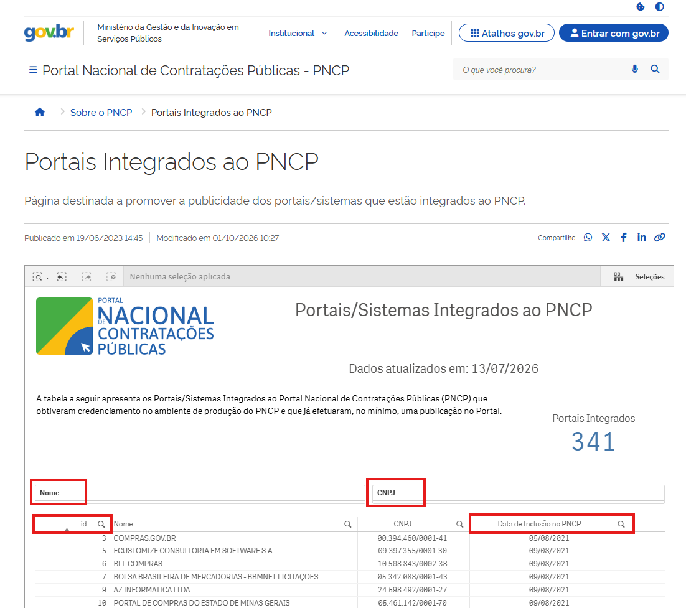

Identificador de Usuário
~~~~~~~~~~~~~~~~~~~~~~~~

Para uso de algumas APIs pode ser necessário incluir o Identificador Único do
portal ou sistema integrado (idUsuario). Essa informação pode ser encontrada acessando o
sítio: `Portais Integrados ao PNCP — Portal Nacional de Contratações Públicas - PNCP`_ .
Na tabela apresentada, o usuário pode realizar a pesquisa utilizando os campos **"ID”**, **“Nome”** ou **“CNPJ”**, destacados em vermelho na imagem a seguir. Além disso, é possível verificar a data de inclusão do portal, disponível na coluna **“Data de Inclusão no PNCP”**.

.. raw:: html

    

.. _Portais Integrados ao PNCP — Portal Nacional de Contratações Públicas - PNCP:
   https://www.gov.br/pncp/pt-br/pncp/portais-integrados-ao-pncp

